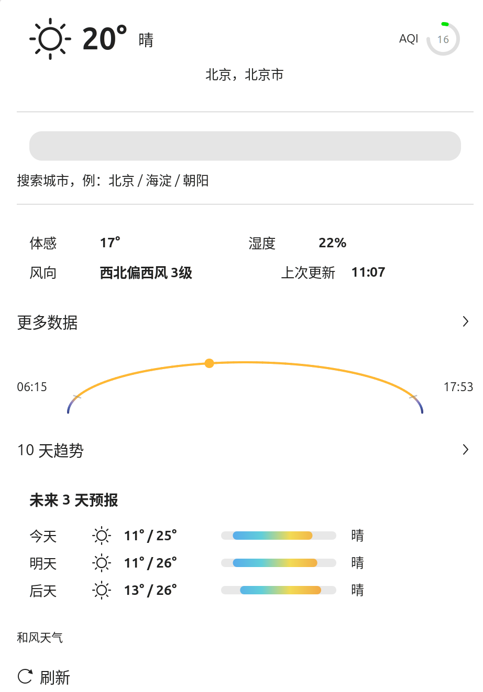
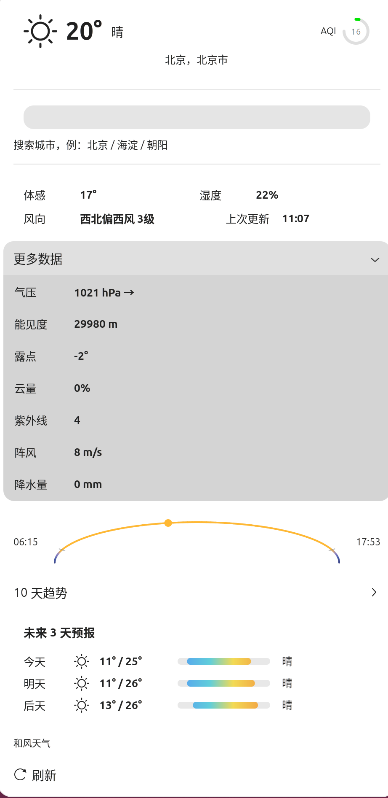
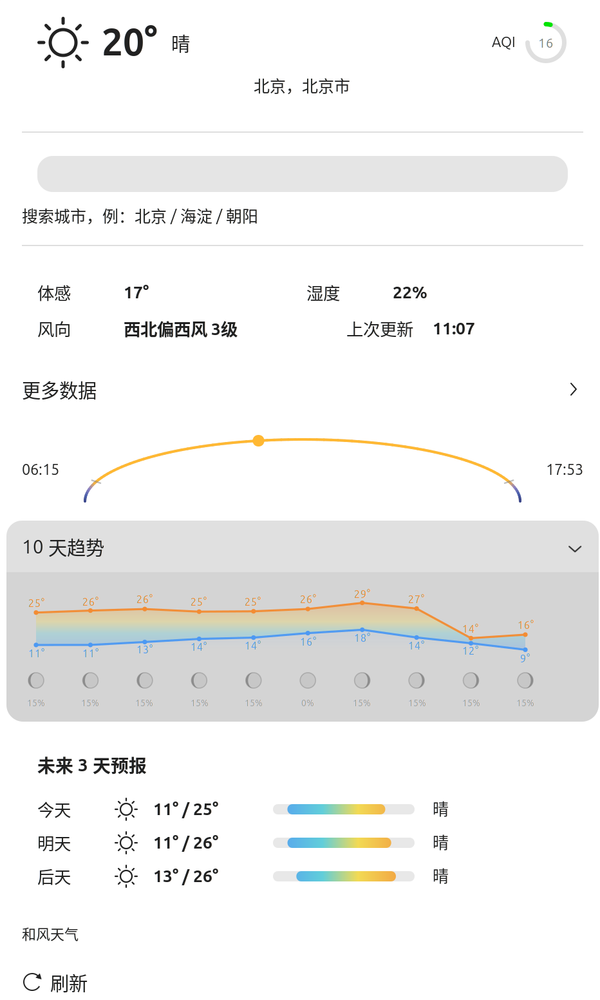

# ClimaCN - 中国天气 GNOME Shell 扩展


**国内 GNOME 用户一直缺少一个精准的天气扩展。**
ClimaCN 内置全国城市数据库，支持自定义 API Host，图标完美适配深色顶栏。
数据源默认用和风天气，也可以按内容类别分别改用免 Key 的 Open-Meteo。

## ✨ 功能特性

**天气**

- 🏙️ 内置全国城市数据库，支持汉字搜索
- 🌡️ 实时温度、体感温度、湿度、风向风力
- 📊 气压（含三小时变化趋势）、能见度、露点、云量、紫外线指数、阵风、降水量
- 🟢 空气质量色环（AQI），按等级变色
- 📅 每日预报，含相对冷暖的温度条
- 📈 未来 10 天趋势折线（可折叠），逐点标注温度
- ⚠️ 天气预警，按国标四级配色（**默认关闭**）

**天文**

- 🌅 全天弧：跨度从天文晨光始到天文暮光终，弧体按天文/航海/民用三段曙暮光着色，
  日出日落处有刻度，太阳圆点标出当前时刻
- 🌙 月亮弧线：月出到月落，弧上的圆盘随当月月相盈亏变化
- 🌗 逐日月相：10 天趋势里附一排月相，和温度走势对照着看

**其它**

- 🗓️ 日历菜单卡片：天气也能出现在点顶栏时钟弹出的面板里（**默认关闭**）
- ⚙️ 四类内容（实时 / 预报 / 空气质量 / 天文）可分别选择数据源
- 🎨 图标自动适配 GNOME 深色顶栏，跟随主题着色
- 🔋 每 15 分钟自动刷新，电池供电时延长到 30 分钟
- 🔒 凭据只存在本机，不出现在日志里；调试日志默认关闭

> 天文部分的数据全部取自扩展本来就在调用的每日预报响应，**不增加任何请求次数**。

## 📸 界面

<p align="center">
  
  
  
</p>

## 📦 安装方法

支持 GNOME Shell 45 – 51。

### 安装

1. 下载 [最新版本](https://github.com/S3608362/gnome-shell-extension-climacn/releases/latest) 的 `.shell-extension.zip`

2. 解压到扩展目录：

   ```bash
   mkdir -p ~/.local/share/gnome-shell/extensions/climacn-weather@outlook.com
   unzip -o climacn-weather@outlook.com.shell-extension.zip \
     -d ~/.local/share/gnome-shell/extensions/climacn-weather@outlook.com
   ```

3. 编译 Schema：

   ```bash
   glib-compile-schemas \
     ~/.local/share/gnome-shell/extensions/climacn-weather@outlook.com/schemas/
   ```

4. 重启 GNOME Shell：

   - **X11**：按 `Alt+F2`，输入 `r`，回车
   - **Wayland**（多数发行版的默认会话）：注销后重新登录

5. 打开「扩展」应用，启用 ClimaCN

### 配置

点击扩展的齿轮图标打开首选项。和风天气的两项凭据可在
[和风天气控制台](https://console.qweather.com/)获取：

| 项 | 位置 |
| --- | --- |
| **API Key** | 控制台 → 项目管理 → 凭据 |
| **API Host** | 控制台 → 设置，形如 `abcxyz.qweatherapi.com`，**不要**写 `https://` |

> ⚠️ 自 v1.3 起 **API Host 为必填**。和风天气的公共 API 地址（`devapi.qweather.com` 等）
> 自 2026 年起逐步停止服务，扩展已迁移到新版 v1 接口。

**没有和风凭据也能用**：首选项「数据源」里把各项选成 Open-Meteo 即可，它免注册、
无需 Key，代价是会把你所选城市的经纬度发送给它。

## 数据来源

天气数据默认来自[和风天气](https://www.qweather.com/)，归因说明见
<https://developer.qweather.com/attribution.html>。需要自备 API Key 与 API Host。

首选项「数据源」分组里，**实时天气 / 逐日预报 / 空气质量 / 天文**四项可以分别选择
「自动 / 和风天气 / Open-Meteo」。两个源各有长短，可以混着用：

| | 和风天气 | Open-Meteo |
| --- | --- | --- |
| 逐日预报 | 10 天 | **16 天** |
| 三段曙暮光 | ✅ | ❌ |
| 月相 | 八相名称 | **连续照亮比例**（圆盘画得更准） |
| 空气质量 | 直接返回指数 | 只给六项污染物浓度，由扩展按**中国国标 HJ 633** 计算 |
| 凭据 | 需要 Key + Host | 免 Key |

选「自动」时，填了和风凭据就用和风，否则用 Open-Meteo。**Open-Meteo 是第三方免费服务**，
用它时扩展会把所选城市的经纬度发送过去。

**天气预警**是可选项（默认关闭），数据来自中国气象局官网 `weather.cma.cn`。
它是气象局官网的内部接口，没有公开文档与稳定性承诺，仅在中国大陆境内可用；
取不到时整行静默隐藏，不影响其它内容。扩展附带一份 2440 个站点的索引用于定位，
不需要联网查表。

无论用哪个数据源，菜单底部都会标明实际来源。

## 常见问题

**Q：图标全是黑色？**
A：确保图标文件以 `-symbolic.svg` 结尾，GNOME 会自动适配。

**Q：填了凭据但获取失败？**
A：依次检查：① API Host 是否填的是自己账号的地址（不是 `devapi.qweather.com`）；
② API Key 是否有效；③ 该凭据是否开启了 API 限制但未包含天气接口。
需要看具体的 HTTP 状态码时，在首选项的「排查问题」里打开**输出调试日志**，
再运行 `journalctl -f -o cat /usr/bin/gnome-shell`。日志默认关闭，
因为扩展跑在 GNOME Shell 进程里，持续输出会拖慢整个桌面会话。

**Q：菜单里没有空气质量色环？**
A：色环需要凭据开通了空气质量接口。取不到数据时连续失败两次后整块隐藏，
不影响其它数据。也可以把「空气质量」一项选成 Open-Meteo。

**Q：空气质量数字和官方发布的不一样？**
A：选 Open-Meteo 时，指数是扩展按国标 HJ 633 从六项污染物浓度**计算**出来的，
不是官方发布值。和风直接返回指数，数值以它为准。

**Q：为什么没有月亮弧线？**
A：月亮每天晚升起约 50 分钟，偶尔会有一整个自然日里既没有月出也没有月落
（约每月各一次）。这时月出到月落的跨度无法确定，整行会隐藏。日出日落同理，
高纬度地区的极昼极夜期间也会缺失。

**Q：菜单显示「上次更新」是什么时间？**
A：是最近一次成功获取到数据的时间（手动刷新和自动刷新都会更新它）。
和风天气的实时接口不返回观测时间，所以这里显示的是扩展拉取数据的时间。

**Q：改了 API Key 或 Host 之后没反应？**
A：保存后约 1 秒会自动重新拉取，不需要重载扩展。

**Q：日历菜单或天气预警要开吗？**
A：两项都默认关闭，在首选项「显示」里开启。它们各自依赖一个 GNOME Shell 或
第三方服务的内部接口，可能随版本失效，所以没有默认打开；失效时都只会自己隐藏，
不影响扩展的其它部分。

## 🖼️ 图标版权

天气图标来源于 [和风天气图标库](https://icons.qweather.com/)，采用
[CC BY 4.0](https://creativecommons.org/licenses/by/4.0/) 许可。

城市数据库与站点索引来自各自服务的公开数据，仅用于按名称与坐标定位，
不包含任何用户信息。

## 📄 开源协议

**GPL-2.0-or-later** —— GNU 通用公共许可证第 2 版，或（由你选择）任何更新的版本。

Copyright (C) 2026 S3608362

本扩展是自由软件：你可以按自由软件基金会发布的 GNU 通用公共许可证条款重新发布和/或修改它。
本扩展出于实用目的分发，但**不提供任何担保**，甚至不包含可商售性或特定用途适用性的默示担保。
版权行与授权声明见 [NOTICE](NOTICE)，完整许可证原文见 [LICENSE](LICENSE)。
